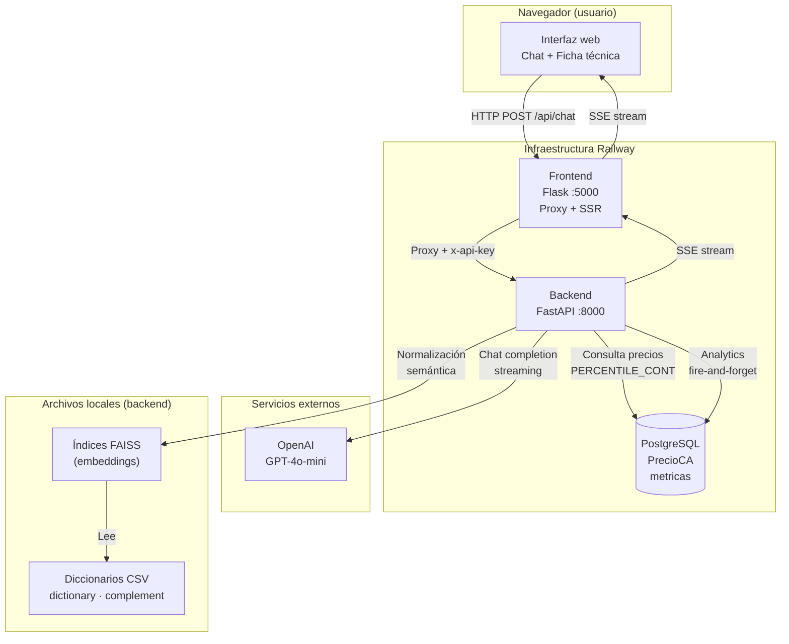
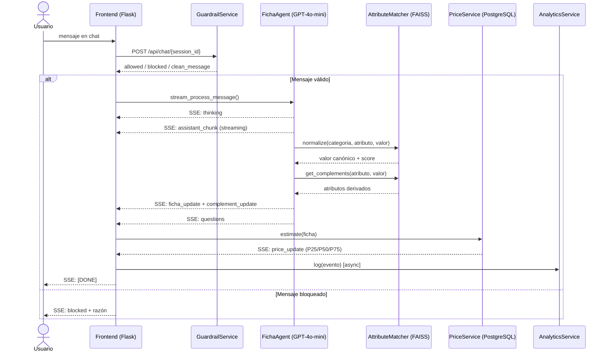

# Asistente IA · Compra Ágil — MVP 1

Herramienta conversacional de IA que automatiza la preparación de **fichas técnicas de computadores** en la plataforma [Compra Ágil](https://www.mercadopublico.cl) del sistema Mercado Público de Chile.

> **Estado:** Desarrollo completado · Presentado a ChileCompra · Listo para pruebas de integración  
> **Versión:** `v1.0.0` · Primer deploy Railway: 15 mayo 2026, 12:15 PM GMT-4  
> **Repos:** [`github.com/eduardomoyab/MVP1-AIChileCompra-backend`](https://github.com/eduardomoyab/MVP1-AIChileCompra-backend) · [`github.com/eduardomoyab/MVP1-AIChileCompra-frontend`](https://github.com/eduardomoyab/MVP1-AIChileCompra-frontend)

---

## Estructura del repositorio

```
MVP1/
├── MVP1-AIChileCompra-backend/       # API FastAPI — lógica, IA, FAISS, precios
│   ├── agents/                       # FichaAgent, AttributeMatcher, embeddings
│   ├── services/                     # PriceService, GuardrailService, analytics
│   ├── diccionarios/
│   │   ├── attribute_dictionary.csv  # Vocabulario canónico Compra Ágil
│   │   └── attribute_complement.csv  # Reglas de atributos derivados
│   ├── models/lgbm/                  # Modelos LightGBM (desactivados en v1.0.0)
│   └── main.py
└── MVP1-AIChileCompra-frontend/      # Servidor Flask — interfaz web y proxy
    ├── app.py
    ├── templates/index.html
    ├── static/js/app.js
    └── imagenes/
```

---

## Diagrama del sistema



---

## Flujo de una interacción



---

## Versión y despliegue

| Campo | Valor |
|---|---|
| Versión | `v1.0.0` |
| Tag git | `v1.0.0` en ambos repos (backend y frontend) |
| Commit de referencia | `05f0598` |
| Primer deploy Railway | 15 mayo 2026, 12:15 PM GMT-4 |
| Infraestructura | Railway — 3 servicios: backend, frontend, PostgreSQL |
| Categoría cubierta | Computadores (Laptops, Desktops, AIO, Workstations) |

---

## Lógica de estimación de precio

El precio estimado que se muestra al comprador se calcula directamente sobre **transacciones históricas reales de Compra Ágil** (Órdenes de Compra adjudicadas), almacenadas en la tabla `PrecioCA` de PostgreSQL.

### Regla de cálculo

```sql
SELECT
    COUNT(*)                                                              AS n,
    PERCENTILE_CONT(0.25) WITHIN GROUP (ORDER BY precio_unitario::numeric) AS p25,
    PERCENTILE_CONT(0.50) WITHIN GROUP (ORDER BY precio_unitario::numeric) AS mediana,
    PERCENTILE_CONT(0.75) WITHIN GROUP (ORDER BY precio_unitario::numeric) AS p75,
    -- mismo cálculo para precio_unitario_iva
FROM "PrecioCA"
WHERE
    LOWER(COALESCE(es_accesorio::text, 'false')) != 'true'   -- excluye accesorios
    AND precio_unitario::numeric > 200000                     -- mínimo $200.000 CLP
    AND precio_unitario::numeric < 5000000                    -- máximo $5.000.000 CLP
    AND [filtros dinámicos por atributos de la ficha]
```

### Filtros dinámicos

Los atributos completados en la ficha se usan como filtros `WHERE` simultáneos:

- **Valor único:** `columna ILIKE '%valor%'`
- **Lista de alternativas:** `(columna ILIKE '%v1%' OR columna ILIKE '%v2%')`
- **Rango numérico:** `SPLIT_PART(columna, ' ', 1)::numeric BETWEEN min AND max`
- **GPU dedicada:** `tiene_gpu_dedicada = 'true'/'false'`

### Resultado devuelto

El sistema entrega **P25, mediana y P75** tanto en precio neto como con IVA, en CLP. Se muestra una advertencia si el universo de registros supera 1.000 (búsqueda demasiado genérica).


---

## Ejemplo: input → output

### Modo conversacional

**Entrada (turno 1):**
```
Usuario: "Necesito laptops para la oficina de administración, trabajan con Excel con macros y SAP"
```

**Salida (stream SSE):**
```
data: {"type": "thinking"}

data: {"type": "assistant_chunk", "delta": "Para un uso con SAP y Excel con macros, recomiendo al menos 16 GB de RAM y un procesador de línea Core i5 o Ryzen 5."}

data: {"type": "assistant_done"}

data: {"type": "ficha_update", "updates": [
  {"attribute": "tipo_equipo",                "value": "Laptop",                       "source": "ai",   "normalized": true,  "score": 1.0},
  {"attribute": "linea_procesador",           "value": "Intel Core i5",               "source": "ai",   "normalized": false, "score": 1.0},
  {"attribute": "total_ram_gb",               "value": 16,                             "source": "ai",   "normalized": false, "score": 1.0},
  {"attribute": "tecnologia_ram",             "value": "DDR4",                         "source": "ai",   "normalized": false, "score": 1.0},
  {"attribute": "total_almacenamiento_gb",    "value": 512,                            "source": "ai",   "normalized": false, "score": 1.0},
  {"attribute": "tecnologia_disco_principal", "value": "NVMe SSD",                    "source": "ai",   "normalized": false, "score": 1.0},
  {"attribute": "tipo_configuracion_discos",  "value": "solo SSD",                    "source": "ai",   "normalized": false, "score": 1.0},
  {"attribute": "tiene_gpu_dedicada",         "value": false,                          "source": "ai",   "normalized": false, "score": 1.0},
  {"attribute": "sistema_operativo",          "value": "Microsoft Windows 11 Pro",    "source": "ai",   "normalized": true,  "score": 0.96}
]}

data: {"type": "ficha_update", "updates": [
  {"attribute": "frecuencia_ram_mhz",  "value": "3200", "source": "complement", "triggered_by": "tecnologia_ram",  "triggered_value": "DDR4"}
]}

data: {"type": "price_update", "data": {
  "count": 94,
  "p25": 412000,   "median": 489000,   "p75": 567000,
  "p25_iva": 490280, "median_iva": 581910, "p75_iva": 674730,
  "currency": "CLP",
  "match_attrs": ["tipo_equipo","linea_procesador","total_ram_gb","tecnologia_ram","total_almacenamiento_gb","tiene_gpu_dedicada","sistema_operativo"],
  "match_description": "tipo, línea proc., RAM, tecnología RAM, almacenamiento, GPU dedicada, SO"
}}

data: [DONE]
```

---

### Modo descripción técnica

**Entrada:**
```
Usuario: "HP Laptop 15s-eq3023la, AMD Ryzen 5 5500U, 8GB DDR4 3200MHz, 512GB SSD NVMe, Windows 11 Home"
```

**Salida (ficha_update relevante):**
```json
[
  {"attribute": "tipo_equipo",                "value": "Laptop",                        "source": "ai",        "normalized": true,  "score": 1.0},
  {"attribute": "marca",                      "value": "HP",                            "source": "ai",        "normalized": true,  "score": 0.99},
  {"attribute": "procesador_principal",       "value": "AMD Ryzen 5 5500U",            "source": "ai",        "normalized": true,  "score": 0.91},
  {"attribute": "total_ram_gb",               "value": 8,                               "source": "ai",        "normalized": false, "score": 1.0},
  {"attribute": "tecnologia_ram",             "value": "DDR4",                          "source": "ai",        "normalized": false, "score": 1.0},
  {"attribute": "total_almacenamiento_gb",    "value": 512,                             "source": "ai",        "normalized": false, "score": 1.0},
  {"attribute": "tecnologia_disco_principal", "value": "NVMe SSD",                     "source": "ai",        "normalized": false, "score": 1.0},
  {"attribute": "tipo_configuracion_discos",  "value": "solo SSD",                     "source": "ai",        "normalized": false, "score": 1.0},
  {"attribute": "tiene_gpu_dedicada",         "value": false,                           "source": "ai",        "normalized": false, "score": 1.0},
  {"attribute": "sistema_operativo",          "value": "Microsoft Windows 11 Home",    "source": "ai",        "normalized": true,  "score": 0.97},
  {"attribute": "nucleos_procesador",         "value": "6",                             "source": "complement","triggered_by": "procesador_principal"},
  {"attribute": "hilos_procesador",           "value": "12",                            "source": "complement","triggered_by": "procesador_principal"},
  {"attribute": "frecuencia_turbo_procesador_mhz", "value": "4200",                   "source": "complement","triggered_by": "procesador_principal"},
  {"attribute": "generacion_procesador",      "value": "5ta Generación",               "source": "complement","triggered_by": "procesador_principal"},
  {"attribute": "linea_procesador",           "value": "AMD Ryzen 5",                  "source": "complement","triggered_by": "procesador_principal"},
  {"attribute": "frecuencia_ram_mhz",         "value": "3200",                         "source": "complement","triggered_by": "tecnologia_ram"}
]
```

---

### Edición manual de atributo

El usuario edita un campo directamente en la ficha. El backend recalcula complementos y re-estima el precio.

**Entrada — `POST /api/manual_update/{session_id}`:**
```json
{"attribute": "total_ram_gb", "value": 32}
```

**Salida (stream SSE):**
```
data: {"type": "ficha_update", "updates": [
  {"attribute": "total_ram_gb", "value": 32, "source": "user", "normalized": false, "score": 1.0}
]}

data: {"type": "price_update", "data": {
  "count": 18,
  "p25": 561000,      "median": 648000,     "p75": 742000,
  "p25_iva": 667590,  "median_iva": 771120, "p75_iva": 869980,
  "currency": "CLP",
  "match_attrs": ["tipo_equipo","linea_procesador","total_ram_gb","tecnologia_ram","total_almacenamiento_gb","tiene_gpu_dedicada","sistema_operativo"],
  "match_description": "tipo, línea proc., RAM, tecnología RAM, almacenamiento, GPU dedicada, SO",
  "broad_warning": false
}}

data: [DONE]
```

---

### Transacciones históricas

**Entrada — `GET /api/offers/{session_id}`** (sin body, usa la ficha de la sesión activa)

**Salida (hasta 30 OC reales adjudicadas en Compra Ágil, filtradas dentro del rango P25–P75):**
```json
{
  "offers": [
    {
      "codigo_requerimiento": "XXXX-1-COT24",
      "precio_unitario":      489000,
      "precio_unitario_iva":  581910,
      "descripcion":          "Laptop Intel Core i5-1235U, 16GB DDR4, 512GB NVMe SSD, Windows 11 Pro",
      "fecha_modificacion":   "2024-03-12",
      "id_oferta_aquiles":    9000001,
      "codigo_oc":            "XXXX-1-AG24",
      "razon_social":         "Proveedor A SpA",
      "oc_codes":             ["XXXX-1-AG24"],
      "oc_urls":              ["https://www.mercadopublico.cl/PurchaseOrder/Modules/PO/DetailsPurchaseOrder.aspx?CodigoOC=XXXX-1-AG24"],
      "ca_url":               "https://buscador.mercadopublico.cl/ficha?code=XXXX-1-COT24",
      "ca_available":         true
    },
    {
      "codigo_requerimiento": "XXXX-2-COT23",
      "precio_unitario":      462000,
      "precio_unitario_iva":  549780,
      "descripcion":          "Notebook Core i5 11va Gen, RAM 16GB, Disco SSD 512GB, SO Win 11 Pro",
      "fecha_modificacion":   "2023-11-08",
      "id_oferta_aquiles":    9000002,
      "codigo_oc":            "XXXX-2-AG23",
      "razon_social":         "Proveedor B Ltda.",
      "oc_codes":             ["XXXX-2-AG23"],
      "oc_urls":              ["https://www.mercadopublico.cl/PurchaseOrder/Modules/PO/DetailsPurchaseOrder.aspx?CodigoOC=XXXX-2-AG23"],
      "ca_url":               "https://buscador.mercadopublico.cl/ficha?code=XXXX-2-COT23",
      "ca_available":         true
    },
    {
      "codigo_requerimiento": "XXXX-3-COT23",
      "precio_unitario":      531000,
      "precio_unitario_iva":  631890,
      "descripcion":          "Laptop i5 12th Gen 16GB RAM 512GB SSD NVMe W11Pro",
      "fecha_modificacion":   "2023-09-21",
      "id_oferta_aquiles":    9000003,
      "codigo_oc":            "XXXX-3-AG23",
      "razon_social":         "Proveedor C S.A.",
      "oc_codes":             ["XXXX-3-AG23"],
      "oc_urls":              ["https://www.mercadopublico.cl/PurchaseOrder/Modules/PO/DetailsPurchaseOrder.aspx?CodigoOC=XXXX-3-AG23"],
      "ca_url":               "https://buscador.mercadopublico.cl/ficha?code=XXXX-3-COT23",
      "ca_available":         true
    }
  ]
}
```

> `oc_urls` y `ca_url` son links directos a Mercado Público. `razon_social` es el proveedor adjudicado en esa OC.

---

## Configuración rápida

```bash
# 1. Clonar ambos repos
git clone https://github.com/eduardomoyab/MVP1-AIChileCompra-backend.git
git clone https://github.com/eduardomoyab/MVP1-AIChileCompra-frontend.git

# 2. Backend
cd MVP1-AIChileCompra-backend
cp .env.example .env          # completar variables
python -m venv venv && venv\Scripts\activate
pip install -r requirements.txt
python main.py

# 3. Frontend (otra terminal)
cd ../MVP1-AIChileCompra-frontend
cp .env.example .env          # completar API_URL y FRONTEND_API_KEY
python -m venv venv && venv\Scripts\activate
pip install -r requirements.txt
python app.py
```

> Documentación detallada: [`README_backend.md`](https://github.com/eduardomoyab/MVP1-AIChileCompra-backend/blob/main/README_backend.md) · [`README_frontend.md`](https://github.com/eduardomoyab/MVP1-AIChileCompra-frontend/blob/main/README_frontend.md)
