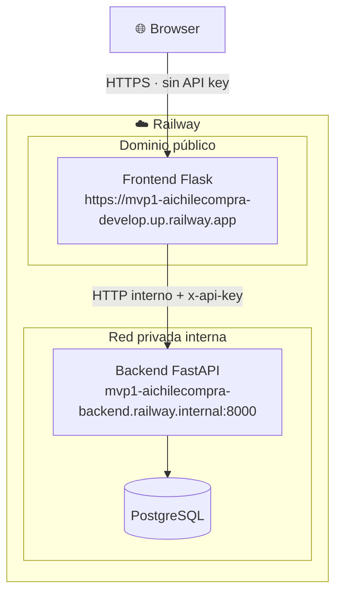
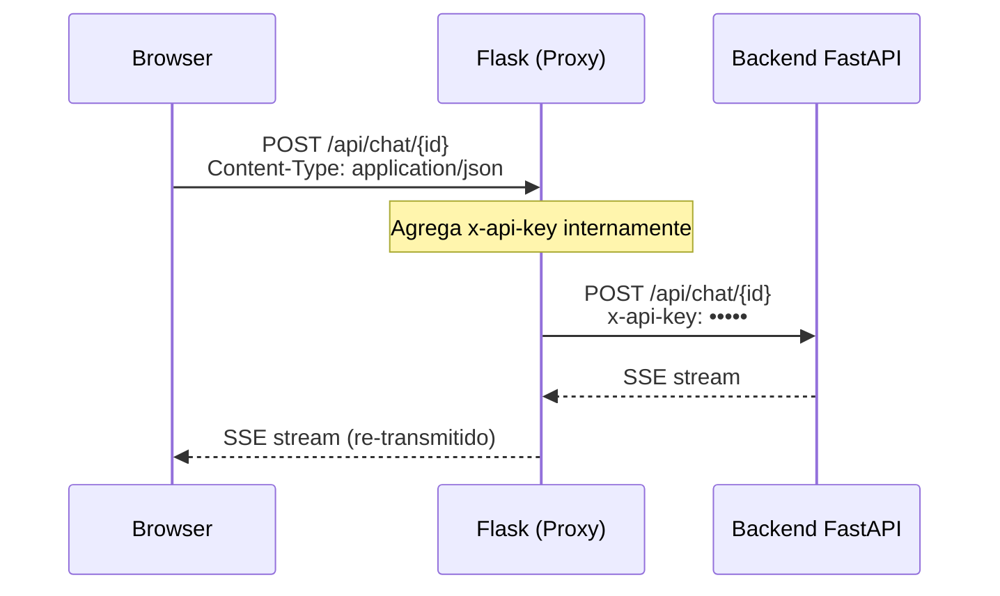
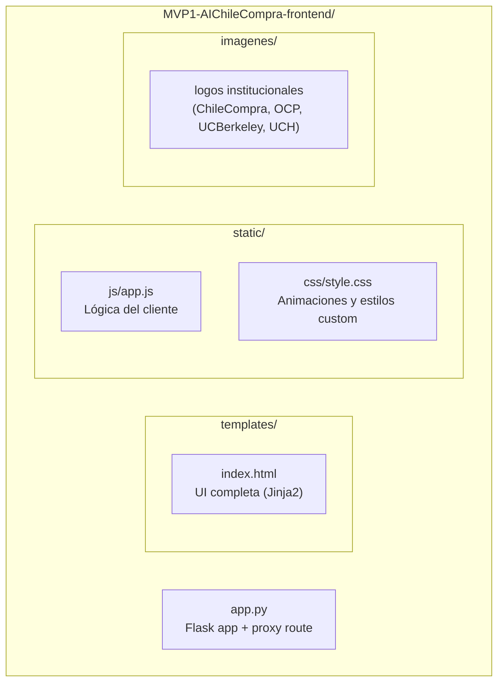
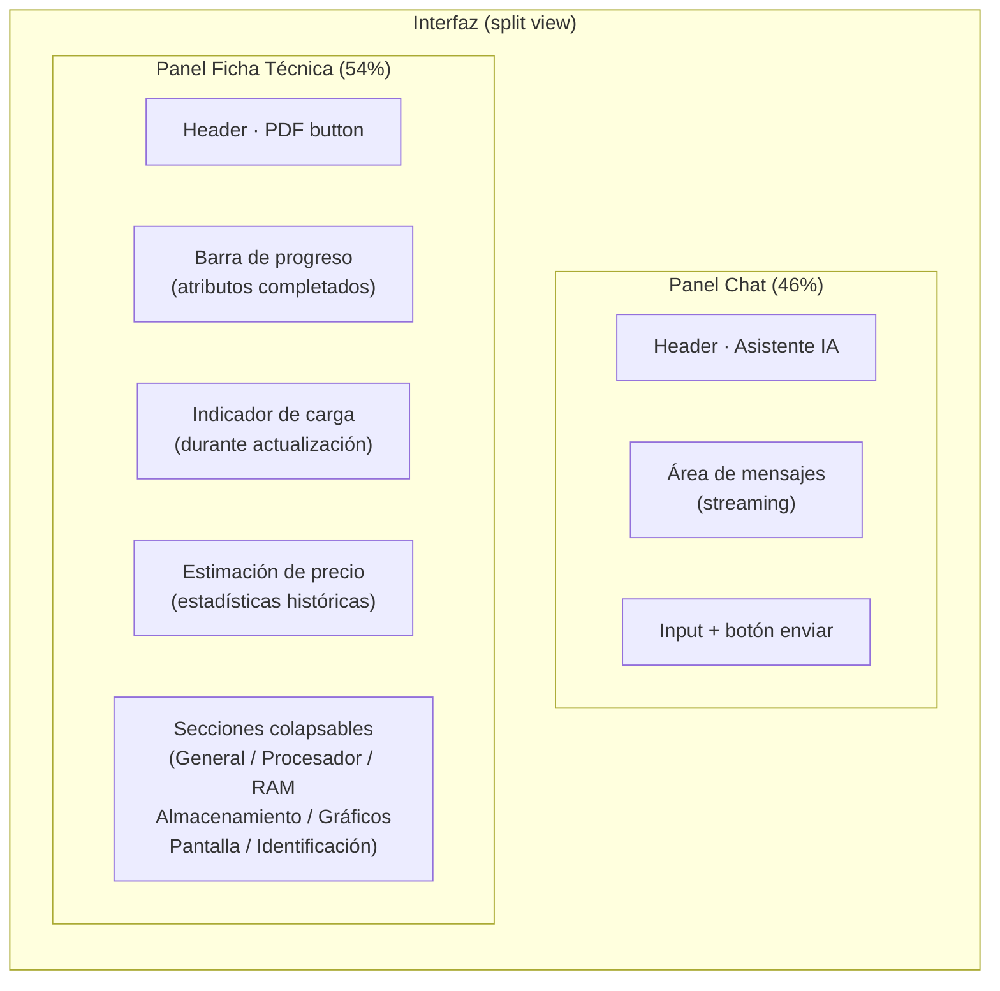
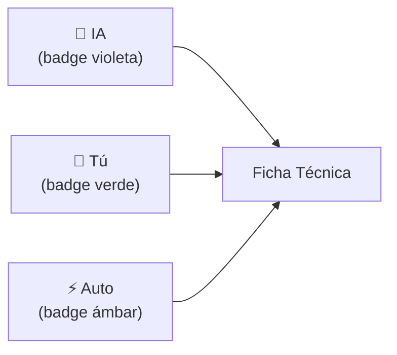

# AIChileCompra — Frontend

Aplicación web construida con **Flask (Python)** que sirve la interfaz del asistente de especificación técnica. Actúa como proxy seguro entre el browser y el backend FastAPI: el browser nunca conoce la URL ni la API key del backend.

---

## Stack tecnológico

| Capa | Tecnología |
|---|---|
| Servidor web | Flask + Gunicorn |
| Plantillas | Jinja2 |
| Estilos | Tailwind CSS (CDN) |
| Interactividad | JavaScript (Vanilla) |
| Streaming | Fetch API + ReadableStream (SSE) |
| Proxy HTTP | httpx (streaming) |
| Contenerización | Docker |
| Despliegue | Railway |

---

## Arquitectura y flujo de proxy



### ¿Por qué proxy?

El browser ejecuta JavaScript del lado del cliente. Si el frontend pasara la URL y API key del backend al JS, cualquier usuario podría verlas en DevTools. Con el proxy:

- El browser solo conoce la URL del **frontend**
- La **API key** vive únicamente en las variables de entorno de Flask (server-side)
- El backend permanece **inaccesible desde internet**



---

## Estructura del proyecto



### `app.py`
Define la aplicación Flask con tres responsabilidades:
1. **Ruta `/`** — sirve `index.html` con Jinja2
2. **Ruta `/api/<path>`** — proxy que reenvía cualquier petición al backend FastAPI con streaming, inyectando la API key server-side
3. **Ruta `/imagenes/<file>`** — sirve los logos institucionales

### `static/js/app.js`
Gestiona toda la interactividad del cliente:
- **`readSSEStream()`** — consume el stream SSE usando `fetch` + `ReadableStream`
- **`handleServerMessage()`** — despacha eventos del servidor (`thinking`, `assistant_chunk`, `ficha_update`, `price_update`, etc.)
- **`applyFichaUpdate()`** — actualiza atributos en la ficha técnica en tiempo real
- **`renderPriceEstimate()`** — renderiza la distribución de precios con gráfico de rango
- **`downloadFichaPDF()`** — genera y abre una ventana de impresión con la ficha formateada

---

## Componentes de la interfaz



### Fuentes de los atributos de la ficha



Cada atributo indica visualmente si fue inferido por el LLM, editado manualmente por el usuario, o complementado automáticamente desde el diccionario.

---

## Variables de entorno

```env
API_URL=http://mvp1-aichilecompra-backend.railway.internal:8000  # URL interna Railway
FRONTEND_API_KEY=    # Clave para autenticar peticiones al backend
FLASK_HOST=0.0.0.0
FLASK_PORT=5000
FLASK_DEBUG=false
PORT=5000            # Railway inyecta esta variable automáticamente
```

---

## Ejecución local

```bash
cd MVP1-AIChileCompra-frontend
python -m venv venv
venv\Scripts\activate        # Windows
source venv/bin/activate     # macOS / Linux
pip install -r requirements.txt

# Crear .env con las variables requeridas
# API_URL debe apuntar al backend local: http://localhost:8000
python app.py
```

Abrir en: `http://localhost:5000`

## Despliegue (Railway)

Railway detecta el `Dockerfile` automáticamente. Las variables de entorno se configuran en **Railway → Frontend service → Variables**. El servicio debe tener **dominio público habilitado** ya que es el punto de entrada de los usuarios. El `API_URL` debe usar el hostname interno de Railway (`*.railway.internal`) para que el proxy funcione sin exponer el backend.
