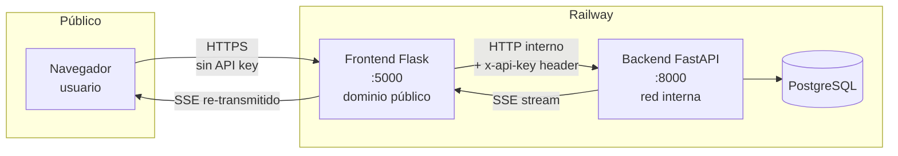
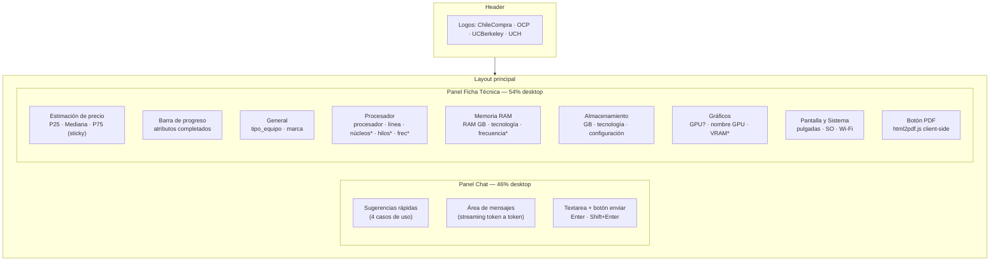

# Frontend — Asistente IA Compra Ágil

Servidor web construido en **Flask** que sirve la interfaz conversacional y actúa como **proxy seguro** entre el navegador y el backend FastAPI. El navegador nunca ve la URL ni la API key del backend.

> Repositorio: `github.com/eduardomoyab/MVP1-AIChileCompra-frontend` · versión `v1.0.0`

---

## Stack tecnológico

| Capa | Tecnología |
|---|---|
| Servidor web | Flask 3.0+ |
| Plantillas | Jinja2 (`templates/index.html`) |
| Estilos | Tailwind CSS (CDN) + CSS custom |
| Fuente | Inter (Google Fonts CDN) |
| Interactividad | JavaScript Vanilla |
| Streaming SSE | `fetch` + `ReadableStream` |
| Generación PDF | html2pdf.js 0.10.1 (html2canvas + jsPDF) |
| Proxy HTTP | httpx (streaming) |
| Despliegue | Railway |

---

## Arquitectura y rol de proxy



El proxy inyecta `x-api-key` server-side en cada petición, manteniendo la clave invisible al navegador y el backend inaccesible desde internet.

---

## Estructura del proyecto

```
MVP1-AIChileCompra-frontend/
├── app.py                  # Flask app: rutas, proxy, configuración
├── requirements.txt
├── .env.example
├── templates/
│   └── index.html          # UI completa (Jinja2) — un solo template
├── static/
│   ├── js/app.js           # Lógica del cliente (Vanilla JS)
│   └── css/style.css       # Animaciones y estilos complementarios
└── imagenes/               # Logos institucionales (ChileCompra, OCP, UCH, UCBerkeley)
```

---

## Rutas Flask

| Ruta | Método | Descripción |
|---|---|---|
| `/` | GET | Sirve `index.html` |
| `/api/<path>` | GET / POST | Proxy transparente al backend (inyecta `x-api-key`, re-transmite SSE) |
| `/imagenes/<filename>` | GET | Sirve logos institucionales |
| `/static/...` | GET | CSS y JavaScript estáticos |

---

## Interfaz de usuario



`*` Campos de solo lectura — completados automáticamente por complemento, sin edición directa.

En **móvil** la interfaz usa tabs (Chat | Ficha) con badge rojo animado cuando llega una actualización de ficha.

---

## Badges de origen de atributos

Cada campo de la ficha muestra de dónde provino su valor:

| Badge | Color | Origen |
|---|---|---|
| **IA** | Violeta | Extraído e inferido por GPT-4o-mini |
| **Tú** | Verde | Ingresado o editado manualmente por el usuario |
| **Auto** | Ámbar | Derivado automáticamente por reglas de complemento |

---

## Editor manual inline

Al hacer clic en el ícono de edición de cualquier campo editable, se despliega el control apropiado según el tipo del atributo:

| Tipo | Control |
|---|---|
| `enum` | Select dropdown con valores fijos |
| `dict` | Input de texto con datalist (valores desde `/api/dropdowns`) |
| `numeric` | Input numérico — soporta valor único, lista o rango min/max |
| `boolean` | Selector Sí / No |
| `free` | Input de texto libre |

---

## Configuración (`.env`)

| Variable | Default | Requerida | Descripción |
|---|---|---|---|
| `API_URL` | `http://localhost:8000` | **Sí** | URL del backend (interna Railway en producción) |
| `FRONTEND_API_KEY` | — | **Sí** | Igual a `FRONTEND_API_KEY` del backend |
| `FLASK_HOST` | `0.0.0.0` | No | Host del servidor Flask |
| `FLASK_PORT` | `5000` | No | Puerto del servidor Flask |
| `FLASK_DEBUG` | `true` | No | Modo debug (`false` en producción) |

---

## Instalación local

```bash
cd MVP1-AIChileCompra-frontend

python -m venv venv
venv\Scripts\activate          # Windows
# source venv/bin/activate     # Linux / macOS

pip install -r requirements.txt

cp .env.example .env
# Configurar:
#   API_URL=http://localhost:8000
#   FRONTEND_API_KEY=<misma clave que el backend>

python app.py
# → http://localhost:5000
```

El backend debe estar corriendo en `API_URL` antes de iniciar el frontend.
